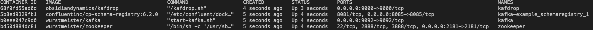

# KFKAJS EXAMPLE

This project will show how to use kafkajs and schema-registry

## Run Kafka

You can run kafka on local environment with this command

```sh
docker-compose up -d
```

after you run command docker will start all about kafka container in this picture


